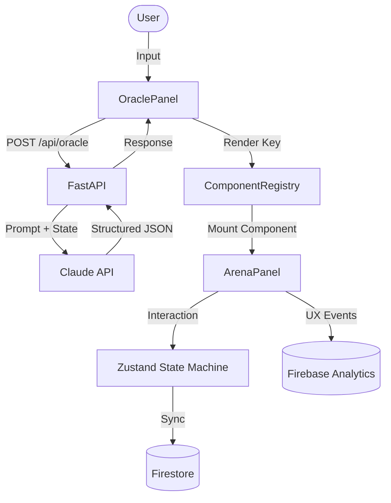

# ELECTRA — Civic Intelligence OS

 

## The Problem
40% of eligible US voters don't vote. The #1 reason: confusion about the 
process. Existing tools are built for people who already know the system.
ELECTRA solves the CONFUSION problem — not the information problem.

## What Makes ELECTRA Different
Not a website. Not a chatbot. An **Agentic UI System** where the AI Oracle 
dynamically controls which React components are rendered in real time.

## Novel Patterns Implemented
- **Agentic UI**: LLM-controlled DOM rendering via structured JSON
- **Temporal Rewind Engine**: time-travel through civic decision history
- **Confusion Heatmap**: passive UX research layer via Firebase Analytics
- **Predictive Shadow Rendering**: AI prefetches next component
- **Consequence Propagation Tree**: mistakes shown as navigable option trees

## Architecture


## Skills Demonstrated
- Agentic UI Architecture (LLM-controlled interfaces)
- Finite State Machine design (45 states, guard conditions)
- Firebase full-stack integration (Auth + Firestore + Analytics + Maps)
- Civic accessibility design (WCAG AA/AAA, multi-language)
- Passive UX research engineering (confusion heatmap)

## Impact Projection
- Journey completion rate tracked in real time
- Confusion heatmap identifies highest drop-off steps
- Architecture scales to any country's election system
- Self-improving: heatmap data tunes Oracle prompts over time

## Roadmap
- **v2**: Official election commission API integration (real data)
- **v2**: Voter registration form submission (real API)
- **v3**: 50+ languages via Oracle language switching
- **v3**: SMS-based Oracle for users without smartphones

## Setup (5 commands)
```bash
git clone https://github.com/Prajinx297/Electra.git
cd Electra && cp .env.example .env  # add your API keys
cd backend && pip install -r requirements.txt && uvicorn main:app
cd ../frontend && npm install && npm run dev
```

## Tests
```bash
npm run test          # Vitest unit + integration
npm run test:e2e      # Playwright E2E
npm run test:coverage # coverage report
```
