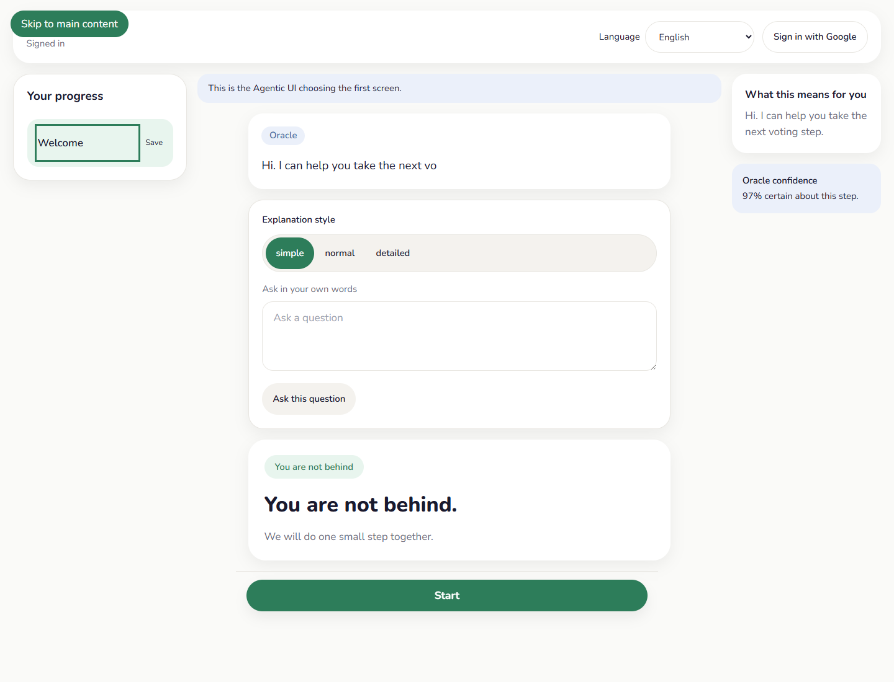
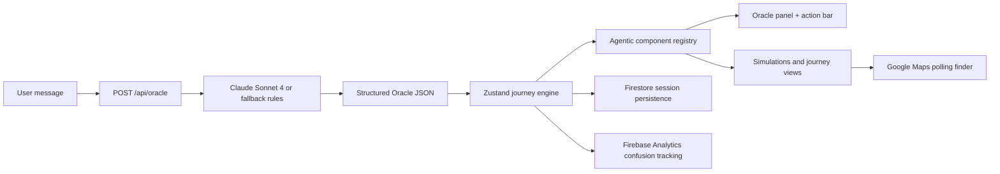

# ELECTRA


ELECTRA is a civic intelligence OS for real voters. The Oracle responds in plain language, decides what the interface should become next, and keeps the experience focused on one step at a time for first-time voters, voters under stress, and people using the product on small or unreliable devices.



## What It Does

- Keeps the interface calm and linear: one clear next action, one active screen, one visible sense of progress.
- Uses an Agentic UI pattern: the FastAPI Oracle returns structured JSON that tells React which component to mount next.
- Persists progress with Firebase Authentication, Firestore session storage, and Firebase Analytics events for journey completion and confusion signals.
- Supports multilingual guidance in English, Spanish, French, and simplified English.
- Explains the election process through interactive simulations instead of walls of text.

## Architecture



## Core Journeys

- Journey 1: first-time voter guidance from registration through voting-day prep.
- Journey 2: registration issue recovery with calm status checking and backup options.
- Journey 3: election-day ID problem support with time-sensitive recovery paths.
- Journey 4: vote counting explainer with an interactive counting and recount simulation.
- Journey 5: accessibility support with accessible polling-place discovery and practical accommodations.

## Novel Patterns

- Agentic UI: the Oracle chooses the next component, action labels, progress label, warning card, and anticipated next render.
- Temporal Rewind: completed steps in the journey sidebar act as rewind points and restore earlier decision states.
- Confusion Heatmap: Firebase Analytics and local event buffering track long pauses, rereads, and backtracking for an admin heatmap view.
- Predictive Shadow Rendering: anticipated components are prefetched so the next screen can feel instant.
- Consequence Propagation Tree: missed deadlines and ID problems expand into a recovery-path graph instead of a dead-end error.
- Multi-language Oracle: the same state can be re-explained in multiple languages and multiple cognitive levels.

## Skills Demonstrated

- Agentic UI architecture with structured LLM outputs driving live DOM changes.
- React 18, TypeScript, Vite, Tailwind tokens, and Framer Motion for accessible product design.
- Zustand state-machine engineering with rewindable history and branch-aware recovery paths.
- Firebase Authentication, Firestore persistence, and Firebase Analytics instrumentation.
- FastAPI backend design, input sanitization, rate limiting, CORS, and secure server-side AI proxying.
- Civic accessibility design for older adults, first-time voters, multilingual users, and mobile-first usage.

## Tech Stack

- Frontend: React 18, TypeScript, Vite, Tailwind CSS, Framer Motion, Recharts, React Flow, Zustand
- Backend: FastAPI, Anthropic SDK, Firebase Admin
- Google Services: Firebase Auth, Firestore, Firebase Analytics, Google Maps JavaScript API, Google Fonts
- Testing: Vitest, React Testing Library, Playwright, Pytest, GitHub Actions

## Project Layout

```text
electra/
├── frontend/
│   ├── src/
│   │   ├── components/
│   │   ├── design/
│   │   ├── engines/
│   │   ├── firebase/
│   │   ├── i18n/
│   │   └── utils/
│   └── tests/
├── backend/
│   ├── routes/
│   ├── services/
│   └── tests/
├── docs/
└── .github/workflows/test.yml
```

## Local Setup

1. `copy .env.example .env`
2. `npm install`
3. `pip install -r backend/requirements.txt`
4. `npm run dev`
5. `npm test`

## Environment Variables

- Frontend: `VITE_API_BASE_URL`, Firebase web config vars, `VITE_GOOGLE_MAPS_API_KEY`
- Backend: `ANTHROPIC_API_KEY`, `ANTHROPIC_MODEL`, Firebase admin vars, `FRONTEND_ORIGIN`

## Testing

- Frontend coverage: `npm --prefix frontend run coverage`
- Frontend E2E: `npm --prefix frontend run test:e2e`
- Backend API tests: `python -m pytest backend`
- CI workflow: `.github/workflows/test.yml`

Current verified local results:

- Frontend coverage: `98.29%` statements, `80%` branches, `100%` functions, `98.29%` lines
- Frontend build: passing
- Playwright E2E: 7 passing specs
- Backend pytest: 8 passing tests

## Security

- Anthropic API calls stay server-side in FastAPI.
- User text is sanitized before Oracle prompt construction.
- `/api/oracle` is rate-limited to 10 requests per minute.
- Firebase session writes are scoped per user path.
- CSP, `nosniff`, and strict referrer-policy headers are applied by the backend.
- CI runs `npm audit` and `pip-audit`.

## Demo Mode

- Press `Ctrl+D` to enter Demo Mode.
- Press `Space` to pause or resume.
- Demo annotations highlight Agentic UI rendering, prediction hits, and rewind-ready state transitions.

## Notes

- Guest mode is the default path. Google sign-in is optional.
- Real Firebase, Google Maps, and Anthropic behavior requires live `.env` values.
- The frontend currently emits reduced-motion warnings inside test output because the test environment intentionally runs with reduced motion enabled.
